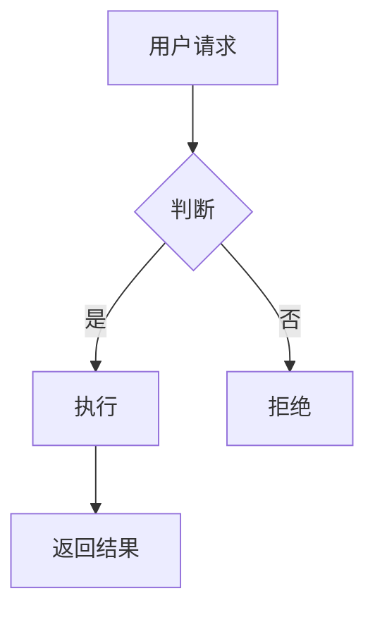

# Mermaid — Markdown 图表

- **领域**: 画图图表
- **类型**: CLI
- **安装**: `npm install -g @mermaid-js/mermaid-cli`
- **收费**: 🟢 完全免费/开源 (MIT)
- **官网**: https://github.com/mermaid-js/mermaid-cli

## 调用模板

```bash
mmdc -i input.mmd -o output.png -w 800 -H 600
# 或SVG: mmdc -i input.mmd -o output.svg
```

## Agent 输出规范



也支持时序图、甘特图、类图等。
